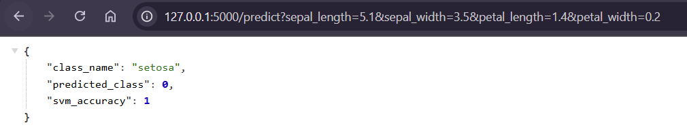
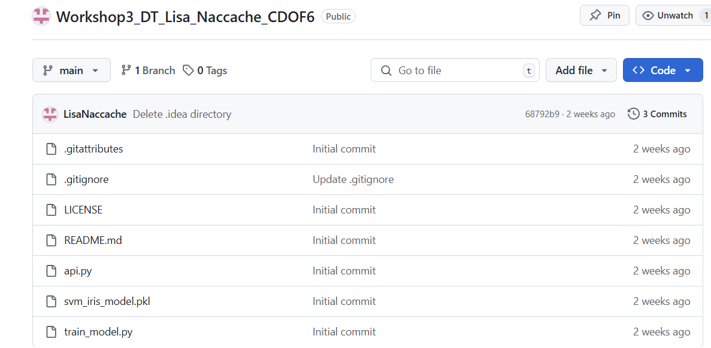
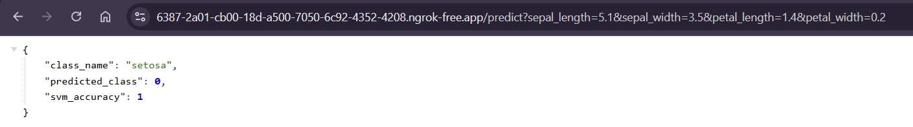
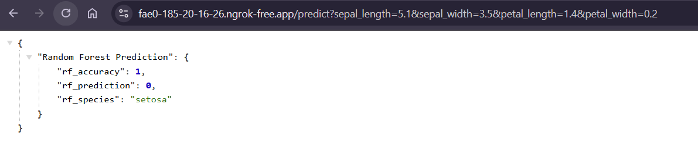

# Workshop3_DT_Lisa_Naccache_CDOF6
 
### Q1 : Develop diverse predictive models targeting the selected dataset. Each group member should create a distinct model.

### Q2 : Generate a consensus prediction by averaging outputs from the group's models, using tools like ngrok for inter-computer connectivity. Assess the performance of this aggregated meta-model.
Ma version avec le NGROK :

https://ec82-2a01-cb00-18d-a500-7050-6c92-4352-4208.ngrok-free.app/predict

La version de Leina Prieur :

https://02ff-185-20-16-26.ngrok-free.app/predict

### Q3 : Introduce a weighting system to refine the meta-model's predictions. Weights, ranging from 0 to 1, are adjusted with each prediction batch to reflect the accuracy of individual models relative to the group consensus.
python client.py
✅ Précision du méta-modèle de consensus pondéré : 1.00
📊 Poids actuels des modèles : {'lisa': 1.0, 'leina': 1.0}
📌 Mise à jour des poids enregistrée dans `database.json` ✅

### Q4 : Implement a proof-of-stake consensus mechanism with a slashing protocol
✅ Précision du méta-modèle de consensus pondéré : 1.00
💰 lisa gagne 150€
💰 leina gagne 110€
📌 Mise à jour des poids et des soldes enregistrée dans `database.json` ✅
📊 Soldes mis à jour : {'lisa': 1150, 'leina': 1110}

